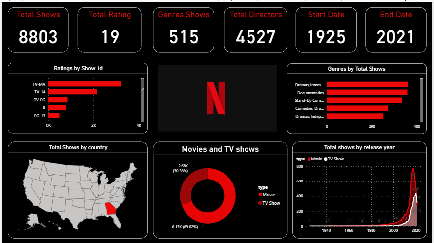

# Netflix Dashboard – Power BI Project

This project is an interactive Power BI dashboard built using a Netflix dataset to explore content trends and patterns. The goal of this project is to turn raw data into meaningful visual insights.

## Project Summary
I analyzed Netflix movie and TV show data to understand genre distribution, release trends, and overall content patterns. The dashboard is designed to be simple, interactive, and easy to explore.

## Tools Used
- Power BI
- Excel

## Key Features
- Genre distribution analysis
- Release year trend visualization
- Interactive filters
- Clean and user-friendly dashboard layout

## Dashboard Preview

## Files in this Repository
- Netflix Pge.pbix → Power BI dashboard
- netflix_data.xlsx → Dataset
- dashboard.png → Dashboard screenshot

---

Created by: Dinakaran V
